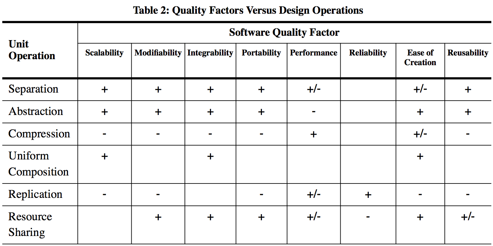

Context and Background
----------------------

In this chapter, we establish a practical context and provide some background information for the study of programming languages.

.. note::

   **Key terms used in this chapter:**

   - *Functional requirement (FR)*: a specification of what the system must do — the mapping from inputs to outputs or observable behaviours.
   - *Nonfunctional requirement (NFR)*: a quality attribute of the system itself, such as testability, performance, reliability, or maintainability.
   - *Refactoring*: improving the internal structure of code without changing its external behaviour. Refactoring improves NFRs such as maintainability and testability.
   - *Continuous integration (CI)*: the practice of automatically building and testing the system each time code is committed, catching integration errors early.
   - *Programming paradigm*: a fundamental style of programming that reflects a model of computation. Different paradigms provide different abstractions; see the :ref:`programming-language-history-and-paradigms` section below.

Software requirements
~~~~~~~~~~~~~~~~~~~~~

In most cases, we develop software to provide some form of value:

- learn a language, library, framework, platform, technique, or tool
  (see also the `ThoughtWorks Technology Radar <https://www.thoughtworks.com/radar>`_)
- solve a problem
- produce an asset

There is usually some tension among these three activities.

The basic categories of requirements are

- functional (FR)

  - output as function of input: `y = f(x)`
  - or some other description of observable behavior

    - batch
    - interactive/event-based

- nonfunctional (NFR): additional properties of `f`, e.g.

  - testability

    - most important nonfunctional requirement
    - allows testing whether functional requirements are met
    - good architecture often happens as a side-effect (APPP pp. 36-38), such as separating I/O from core functionality

  - performance
  - scalability

    - e.g. performance for large data sets: asymptotic order of complexity
    - (big-Oh) in terms of input size n

  - reliability
  - maintainability
  - static versus dynamic NFRs

Several common questions and issues related to requirements arise:

- *how do requirements relate to the project development lifecycle?*
- *BUFD versus MVP*
- *how do testing and refactoring relate to requirements?*

The following figure by Kazman relates unit operations (high-level generalizations of refactorings) to software quality factors (nonfunctional requirements). Each arrow indicates that applying the unit operation (e.g., *modularize*, *abstract*) tends to improve the corresponding quality factor (e.g., maintainability, testability). Notably, *modularize* simultaneously improves both maintainability and testability.

   *Kazman et al.*: unit operations and the quality factors they improve.

As we will see throughout the course, programming language features directly support or hinder the satisfaction of NFRs. Static type systems improve reliability by catching errors at compile time. Immutability and pure functions improve testability by eliminating hidden state. Built-in concurrency primitives improve scalability. The language design chapters will repeatedly refer back to these requirements as motivation for language features.

Overview of a lightweight development process
~~~~~~~~~~~~~~~~~~~~~~~~~~~~~~~~~~~~~~~~~~~~~

A successful development process usually comprises these minimal elements:

- `automated regression testing <https://martinfowler.com/bliki/SelfTestingCode.html>`_

  - tests represent expectations of how the software should behave
  - when expressed as code, these are

    - fun to produce (like other coding)
    - convenient to run frequently

  - fix system-under-test (SUT) (not tests themselves) until tests pass

  - retest every time

    - a feature is added

    - the code is refactored

- `refactoring <https://www.refactoring.com/>`_

  - improve the quality of the code without changing its behavior

    - macro level: nonfunctional requirements (quality factors)

    - micro level: `code smells <https://refactoring.guru/smells/smells>`_

  - `catalog of refactorings <https://refactoring.com/catalog/>`_

- `continuous integration <https://www.martinfowler.com/articles/continuousIntegration.html>`_

The `process tree <https://github.com/lucproglangcourse/processtree-scala>`_ example illustrates continuous integration using various hosted services:

- `Travis CI <https://travis-ci.org/LoyolaChicagoCode/processtree-scala>`_: continuous integration
- `Codecov <https://codecov.io/gh/LoyolaChicagoCode/processtree-scala>`_: test coverage
- `Codacy <https://www.codacy.com/app/laufer/processtree-scala>`_: automated code review

The `click counter <https://github.com/LoyolaChicagoCode/clickcounter-android-java>`_ example includes additional hosted continuous integration and delivery targets suitable for mobile app development.

Software design principles and patterns
~~~~~~~~~~~~~~~~~~~~~~~~~~~~~~~~~~~~~~~

The software development community has identified various principles intended to guide the design and development process, for example:

- `DRY <http://en.wikipedia.org/wiki/Don%27t_repeat_yourself>`_ (don't repeat yourself)
- `SoC <https://en.wikipedia.org/wiki/Separation_of_concerns>`_ (separation of concerns)
- `SOLID <https://en.wikipedia.org/wiki/SOLID_(object-oriented_design)>`_

The community has also developed a body of `design patterns <https://sourcemaking.com/design_patterns>`_ that represent reusable solutions to recurring problems. Some key design patterns we will rely on in this course include

- Iterator
- Strategy
- Command
- Composite
- Decorator
- Visitor
- Abstract Factory
- Observer

We will recap these throughout the course as needed.

.. note:: Language-specific design patterns are called *idioms*.

.. _programming-language-history-and-paradigms:

Programming language history and paradigms
~~~~~~~~~~~~~~~~~~~~~~~~~~~~~~~~~~~~~~~~~~

The resources in this section cover fundamental models of computation, language paradigms, and language principles.

- `overview talk <http://klaeufer.github.io/luc-amc.html>`_ by Läufer and Thiruvathukal
- `programming languages paradigms: diagram <https://www.info.ucl.ac.be/~pvr/paradigmsDIAGRAMeng108.jpg>`_ by Van Roy
- `programming languages paradigms: book chapter <https://www.info.ucl.ac.be/~pvr/VanRoyChapter.pdf>`_ by Van Roy
- :doc:`/80-principles` by MacLennan
- `Turing completeness <https://en.wikipedia.org/wiki/Turing_completeness>`_
- `Church-Turing thesis <https://en.wikipedia.org/wiki/Church%E2%80%93Turing_thesis>`_

A *programming paradigm* is a fundamental style or approach to programming that reflects a mental model of computation. It determines what abstractions are available, how state and control flow are managed, and what kinds of problems a language is best suited for. Peter Van Roy's paradigm diagram (linked above) organises over 30 paradigms by their core features.

The major paradigms covered in this course are:

- **Imperative** (:doc:`/20-imperative`): computation as a sequence of state-changing statements; the dominant paradigm in languages like C, Java, and Python.
- **Object-oriented** (:doc:`/30-objectoriented`): computation modelled through objects that encapsulate state and behaviour; extends the imperative paradigm with encapsulation, inheritance, and polymorphism.
- **Functional** (:doc:`/40-functional`): computation as the evaluation of mathematical functions; emphasises immutability, higher-order functions, and algebraic data types; exemplified by Haskell, Scala, and Clojure.
- **Logic** (:doc:`/70-logic`): computation as logical deduction; programs are sets of facts and rules and execution is query-driven; exemplified by Prolog.
- **Concurrent** (:doc:`/60-concurrency`): computation as multiple simultaneous activities; raises issues of synchronisation, shared state, and nondeterminism.

A foundational theoretical result bounds all of these paradigms: the *Church-Turing thesis* states that every effectively computable function can be computed by a Turing machine (or equivalently, by a lambda calculus expression, or by a recursive function). A language capable of expressing every Turing-computable function is called *Turing complete*. Understanding this equivalence helps explain why paradigms differ in expressiveness of style but not in fundamental computational power.

Popularity indices and performance comparisons
~~~~~~~~~~~~~~~~~~~~~~~~~~~~~~~~~~~~~~~~~~~~~~

There are a number of programming language popularity indices and performance comparisons.
Before drawing any conclusions from these indices, it is important to understand their *methodology*.

- `PYPL PopularitY of Programming Language index <https://pypl.github.io>`_
- `TIOBE programming community index <http://www.tiobe.com/tiobe-index>`_
- `GitHub language popularity <https://github.blog/2023-11-08-the-state-of-open-source-and-ai>`_ (scroll about half-way down to the relevant section)
- `Stack Overflow developer survey <https://insights.stackoverflow.com/survey>`_
- `Programming languages shootout benchmark <https://benchmarksgame-team.pages.debian.net/benchmarksgame/>`_

.. note::

   When consulting any popularity or performance index, ask: *What is the data source?* (search queries, job postings, GitHub commits, or benchmark runs each capture different things.) *What counts as "a language"?* (Some indices conflate dialects or treat Jupyter notebooks as Python.) *Does the index weight by project size or contributor count?* Understanding methodology prevents over-interpreting rankings. The PYPL and TIOBE indices publish their methodology; always read it before drawing conclusions.