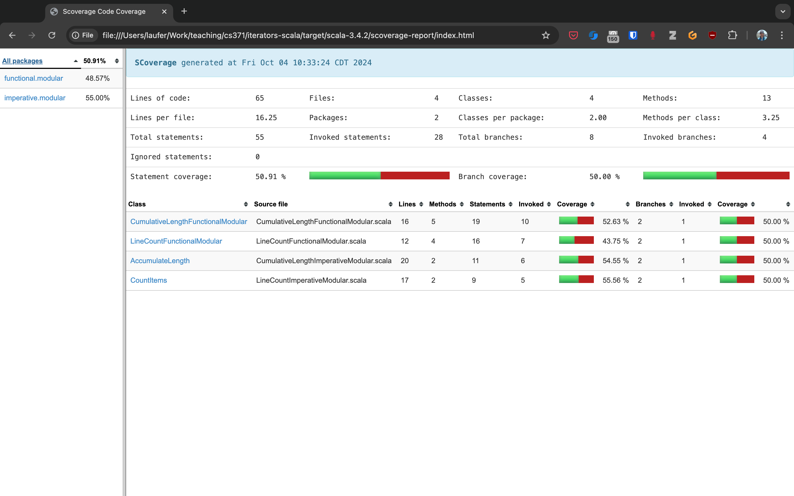
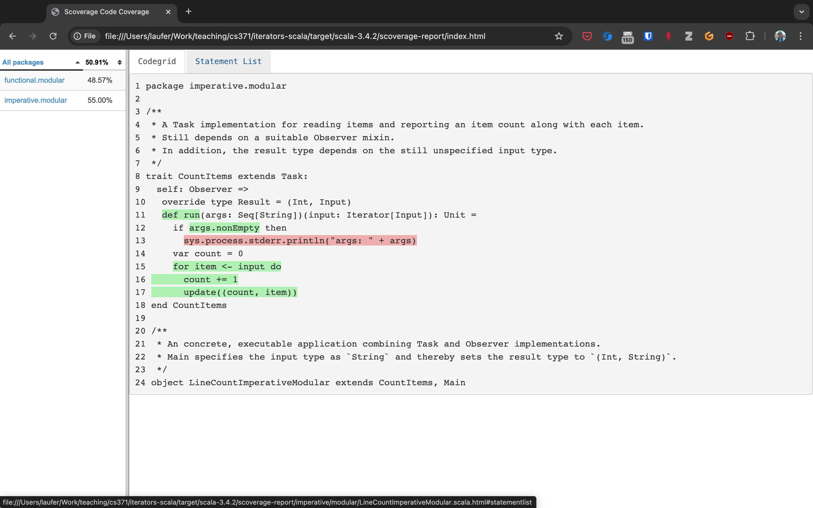
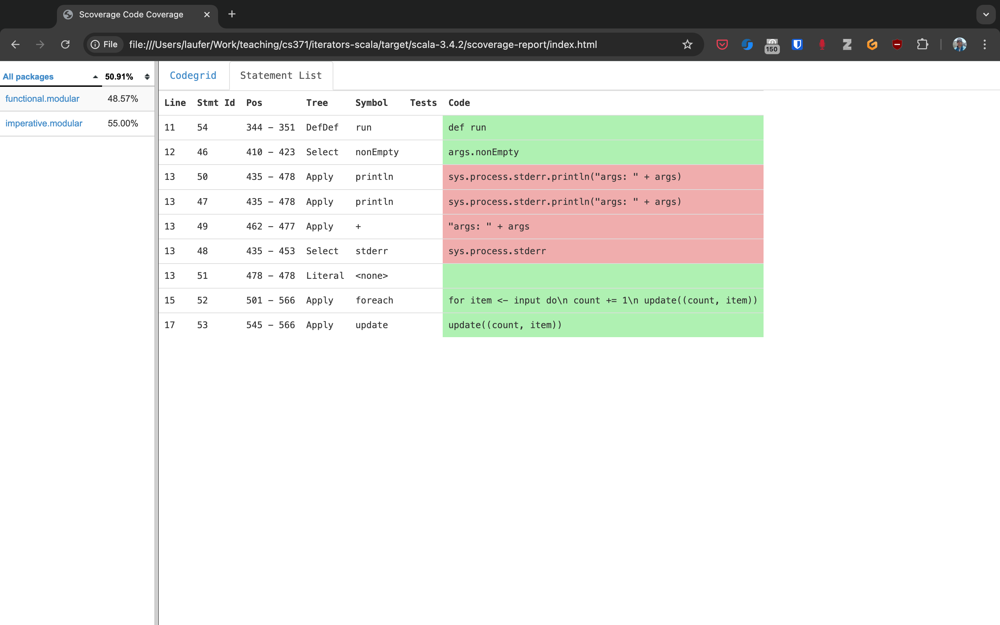

The Imperative Programming Paradigm
-----------------------------------

In this chapter, we discuss the *imperative programming paradigm* with examples in Scala.
To differentiate this from the object-oriented paradigm in practice, we define imperative code to mean code that uses a language's control-flow constructs along with its built-in types, including primitive types and built-in type abstractions for strings, collections, input/output, and other general-purpose building blocks.
By contrast, we define object-oriented code to mean code that includes definitions of domain models or other new application-specific abstractions, or uses object-oriented frameworks (as opposed to lower-level, general-purpose object-oriented libraries).

.. note:: Arguably, this definition of the imperative paradigm may be closer to a definition of the *scripting style* because most imperative languages do provide mechanisms for introducing new type abstractions. 
  For pedagogical reasons, we will still discuss those capabilities the next chapter as part of the object-oriented paradigm.


Options for running Scala code
~~~~~~~~~~~~~~~~~~~~~~~~~~~~~~

In this section, we discuss the different options for running Scala code, including applications and tests.

- The simplest way to run Scala code fragments is through the Scala REPL (read-eval-print loop).
  We can launch the Scala REPL and then evaluate definitions and expressions:

  .. code-block:: scala

    $ scala
    Welcome to Scala 3.2.0 (17.0.4.1, Java OpenJDK 64-Bit Server VM).
    Type in expressions for evaluation. Or try :help.

    scala> 3 + 4
    res0: Int = 7

    scala> def f(x: Int) = x + 2
    f: (x: Int)Int

    scala> f(3)
    res1: Int = 5

    scala> val z = f(4)
    z: Int = 6

    scala> Seq(1, 2, 3).map(f)
    res2: Seq[Int] = List(3, 4, 5)


  This is a very effective, painless way to conduct initial explorations.
  The drawback of this approach is a lack of support for *managed dependencies*, which are required for more advanced work.
  In that case, starting the Scala REPL through sbt as discussed below is a much better choice.
  Managing the Scala/Java classpath manually is discouraged.

  You can also run simple scripts (with optional command-line arguments) directly through the scala interpreter. A ``main`` method or ``@main`` annotation is required, e.g.:

  .. code-block:: bash

    $ cat > blah.scala
    def main(args: Array[String]) = println(args.toList)
    $ scala blah.scala 1 2 3
    List(1, 2, 3)


- In a Scala IDE such as IntelliJ IDEA, we can run Scala applications (classes/objects with a ``main`` method) and Scala tests from within the IDE. To pass command-line arguments to an application, we have to create a suitable run configuration.

- It is best to use `sbt <https://www.scala-sbt.org/>`_ (the Scala Build Tool) for projects with one or more external dependencies because of sbt's (and similar build tools') ability to manage these dependencies in a declarative way:

  .. code-block:: bash

    $ sbt test
    $ sbt run
    $ sbt "run arg1 arg2 ..."
    $ sbt "runMain my.pkg.Main arg1 arg2 ..."
    $ sbt test:run


  In addition, sbt allows you to start a REPL that exposes the code in your project and its managed dependencies.
  This is the preferred way to explore existing libraries:

  .. code-block:: bash

    $ sbt console


  You can also pull in the additional dependencies from the test scope:

  .. code-block:: bash

    $ sbt test:console

  If you want to bypass your own code in case of, say, compile-time errors, you can use one of these tasks:

  .. code-block:: bash

    $ sbt consoleQuick
    $ sbt test:consoleQuick

  In conjunction with a `text editor <https://www.gnu.org/software/emacs>`_, sbt's `triggered execution <https://www.scala-sbt.org/1.x/docs/Triggered-Execution.html>`_ for testing will significantly shorten the edit-compile-run/test cycle, for example:

  .. code-block:: bash

    $ sbt
    ...
    > ~ test


- In general, irrespective of your choice of development environment, a convenient way to do exploratory programming beyond the basic REPL is to start with a single test.
  There, you can develop your ideas and interact with the library APIs you want to explore.
  For simple testing, you can intersperse assertions within your code or use the testing support provided by the chosen testing framework, e.g., `JUnit <https://junit.org/>`_ or `ScalaTest <https://www.scalatest.org/>`_.
  So you can start exploring something in a test and then move it into your production code (`main` folder) when appropriate.
  `The list performance example <https://github.com/lucproglangcourse/cs2-listperformance-scala/blob/main/src/test/scala/cs271/lab/list/TestList.scala>`_ illustrates this approach.


- Finally, to turn an sbt-based Scala application into a script (command-line application) you can run outside sbt, you can use the `sbt-native-packager <https://github.com/sbt/sbt-native-packager>`_ plugin.
  To use this plugin, add this line to the end of ``build.sbt``:

  .. code-block:: bash

    enablePlugins(JavaAppPackaging)

  and this one to ``project/plugins.sbt``:

  .. code-block:: scala

    addSbtPlugin("com.typesafe.sbt" % "sbt-native-packager" % "1.7.5")

  Then, after any change to your sources, you can create/update the script and run it from the command line like so:

  .. code-block:: bash

    $ sbt stage
    ...
    $ ./target/universal/stage/bin/myapp-scala arg1 arg2 ...


Techniques for testing Scala code
~~~~~~~~~~~~~~~~~~~~~~~~~~~~~~~~~

Testing is an important, widely used practice within the software development lifecycle (SDLC).
There are various basic techniques and libraries/frameworks for testing Scala code.

The simplest way is to intersperse assertions within your code.
This is particularly effective for scripts and worksheets:

.. code-block:: scala

  val l = List(1, 2, 3)
  assert { l.contains(2) }

The following testing libraries/frameworks work well with Scala.

- The familiar `JUnit <http://junit.org>`_ can be used directly.
- `ScalaCheck <http://scalacheck.org>`_ is a testing framework for Scala that emphasizes property-based testing, including universally quantified properties, such as "for all lists ``x`` and ``y``, the value of ``(x ++ y).length`` is equal to ``x.length + y.length``"
- `ScalaTest <http://scalatest.org>`_ is a testing framework for Scala that supports a broad range of test styles including behavior-driven design, including integration with ScalaCheck.
- `specs2 <http://etorreborre.github.io/specs2>`_ is a specification-based testing library that also supports integration with ScalaCheck.
- `MUnit <https://github.com/scalameta/munit>`_ is a newer testing library for Scala.

The `echotest <https://github.com/lucproglangcourse/echotest-scala>`_ example shows some of these libraries in action.

For faster turnaround during development, we can combine these techniques with `triggered execution <https://www.scala-sbt.org/1.x/docs/Triggered-Execution.html>`_.


Measuring code coverage
```````````````````````

The *code coverage* of your tests indicates how thoroughly you're testing.
Typically, you would use the `sbt scoverage plugin <https://github.com/scoverage/sbt-scoverage>`_ to meaasure what percentage of your main code are covered by your tests.

.. code-block:: bash

  $ sbt clean coverage test coverageReport

Once these tasks complete, you should see the coverage percentages toward the end of the terminal output,

.. code-block:: bash

  [info] Statement coverage.: 50.91%
  [info] Branch coverage....: 50.00%


and your test reports should then be available at

.. code-block:: bash

  target/scala-*/scoverage-report/index.html

When you open this file in your web browser (or preview it in Gitpod using the `Live Preview extension <https://marketplace.visualstudio.com/items?itemName=ms-vscode.live-server>`_), you will see a navigable visualization of the code coverage report.



Here you can drill into specific packages and classes.
When looking at a class, you can switch between the source code view and an abstract statement view.





If your coverage percentages appear low, you can make them more accurate by excluding classes you are not testing programmatically, such as those focused on providing a main method responsible mostly for I/O.
(This works only with Scala version 3.4.2 or higher; also check ``project/plugins.sbt`` to make sure you're running the latest version of the sbt-scoverage plugin.)

.. code-block:: scala

  ccoverageExcludedPackages := """.*\.simple\..*;.*\.common.*;.*\.Main;benchmark\..*"""

Additional information on testing is available in the corresponding section of the `COMP 335/435: Formal Methods lecture notes <https://lucformalmethodscourse.github.io/30-testing.html>`_.


End-to-end application testing
``````````````````````````````

Besides the familiar styles of unit testing, one could attempt to automate the process of end-to-end application testing.
One approach would be to use shell scripts in conjunction with sample input and expected output files; 
after running the application on the sample input, one could use a ``diff`` utility to compare the actual output to the expected output.

This approach adds complexity in terms of maintaining an additional set of data files, however, and it is brittle in that the test may no longer be valid after changes in the output format of the application under test.
Therefore, it is usually preferable to use the unit testing techniques described above at the data structure level as opposed to comparing formatted output.

On the other hand, if one really wants to test the I/O code, one could set up programmatic end-to-end application tests as part of an automated test suite by redirecting the standard input and output to in-memory streams one can populate or examine programmatically.
This approach appears to work within IDEs such as IntelliJ but not in a standalone invocation of sbt.

.. code-block:: scala

  @Test
  def testMainEndToEnd: Unit =
    val ba = new ByteArrayOutputStream
    val os = new PrintStream(ba)
    System.setOut(os) // redirect stdout to the in-memory stream
    main.Main.main(Array.empty[String])
    val lines =
      import scala.language.unsafeNulls
      ba.toString.lines.toList.asScala
    assertEquals("hello", lines(0))
    assertEquals("hello hello", lines(1))


The role of command-line applications
~~~~~~~~~~~~~~~~~~~~~~~~~~~~~~~~~~~~~

Command-line applications have always been an important part of the UNIX environment.
Each application typically focuses on a specific task, and several applications can be composed to solve a more complex task.

The typical command-line application interacts with its environment in the following ways:

- *environment variables* defined in your system
- zero or more application-specific *command-line arguments* for passing options to the application: ``app arg1 arg2 ...``
- *standard input* (stdin) for reading the input data
- *standard output* (stdout) for writing the output data
- *standard error* (stderr) for displaying error messages separately from the output data

From a Scala perspective, environment variables are accessible via the predefined ``sys.env`` map, e.g., ``sys.env("HOME")``, and command-line arguments are accessible via the main method's argument ``args`` (a string array).
Similar mechanisms are available in Java and other JVM languages.

.. note:: In addition, languages running on a Java Virtual Machine (JVM) support *properties* defined through command-line arguments of the form ``-Dmy.prop=someValue`` and accessible via, e.g., ``sys.props("my.prop")``.

Applications that read and write from and to the standard data streams can function as composable building blocks using UNIX pipes.
Using these standard I/O mechanisms is much more flexible than reading from or writing to specific files whose names are hardcoded in the program.

E.g., the ``yes`` command outputs its arguments forever on consecutive output lines,
the ``head`` command outputs a finite prefix of its input,
and the ``wc`` command counts the number of characters, words, or lines:

.. code-block:: bash

  $ yes hello | head -n 10 | wc -l

You may wonder how the upstream (left) stages in the pipeline know when to terminate.
Concretely, how does the ``yes`` command know to terminate after ``head`` reads the first ten lines.
When ``head`` is done after reading and passing through the specified number of lines, it closes its input stream, and ``yes`` will receive an error signal called ``SIGPIPE`` when it tries to write further data to that stream.
The default response to this error signal is termination.
For more details on ``SIGPIPE``, see `this StackExchange response <https://unix.stackexchange.com/a/84828>`_.

We can also use the control structures built into the shell. E.g., the following loop prints an infinite sequence of consecutive integers starting from 0:

.. code-block:: bash

  $ n=0 ; while :; do echo $n ; ((n=n+1)) ; done

These techniques are useful for producing test data for our own applications.
To this end, we can redirect output to a newly created file using this syntax:

.. code-block:: bash

  $ n=0 ; while :; do echo $n ; ((n=n+1)) ; done > testdata.txt

If ``testdata.txt`` already exists, it will be overwritten when using this syntax.
We can also append to an existing file:

.. code-block:: bash

  $ ... >> testdata.txt

Similarly, we can redirect input from a file using this notation:

.. code-block:: bash

  $ wc -l < testdata.txt

There is a close relationship between UNIX pipes and functional programming: When viewing a command-line application as a function that transforms its input to its output, UNIX pipes correspond to function composition. The pipeline ``p | q`` corresponds to the function composition ``q o p``.


Command-line applications in Scala
``````````````````````````````````

The following techniques are useful for creating command-line applications in Scala.
As in Java, command-line arguments are available to a Scala application as ``args`` of type ``Array[String]``.

We can read the standard input as lines using this iterator:

.. code-block:: scala

  val lines = scala.io.Source.stdin.getLines()

This gives you an iterator of strings with each item representing one line. When the iterator has no more items, you are done reading all the input. (See also this `concise reference <https://alvinalexander.com/scala/how-to-open-read-text-files-in-scala-cookbook-examples>`_.)

To break this iterator of lines down into an iterator of words, we can use this recipe:

.. code-block:: scala

  val words =
    import scala.language.unsafeNulls
    lines.flatMap(l => l.split("(?U)[^\\p{Alpha}0-9']+"))

(We'll discuss ``flatMap`` in detail later.)

The result of ``l.split(regex)`` is an array of strings, where some of the strings or the entire array could possibly be ``null`` because ``split`` is a Java method, where the stated ``String`` type really means ``String`` or ``null``. 
While ``flatMap`` is supposed to preserve the element type of the transformed iterator, splitting the lines in this way could introduce ``null`` references.
Because we require `explicit typing of null references <https://docs.scala-lang.org/scala3/reference/experimental/explicit-nulls.html>`_ (by adding ``"-Yexplicit-nulls"`` to the compiler options in ``build.sbt``), the Scala compiler considers this code incorrect and indicates an error unless we enable this potentially unsafe use of implicit null references.

*To keep null safety in place as widely as possible, it is best to keep this import local to the block(s) performing IO code.
In some cases, it is more convenient to use the* ``.nn`` *extension method to disable null safety for a single expression, e.g.,*

.. code-block:: scala

  System.err.nn.println("D'oh!")

By default, the Java virtual machine converts the ``SIGPIPE`` error signal to an ``IOException``.
In Scala, ``print`` and ``println`` print to stdout, which is is an instance of ``PrintStream``.
This class converts any ``IOException`` to a boolean flag accessible through its ``checkError()`` method.
(See also `this discussion <https://stackoverflow.com/questions/62658078/jvm-not-killed-on-sigpipe>`_ for more details.)

Therefore, to use a Scala (or Java) command-line application in a UNIX pipeline as an upstream component that produces an unbounded (potentially infinite) output sequence, we have to monitor this flag when printing to stdout and, if necessary, terminate execution.

For example, this program reads one line at a time and prints the line count along with the line read.
After printing, it checks whether an error occured and, if necessary, terminates execution by exiting the program:

.. code-block:: scala

  var count = 0
  for line <- lines do
    count += 1
    println((count, line))
    if scala.sys.process.stdout.checkError() then sys.exit(1)


Command-line argument parsing
`````````````````````````````

A common concern when developing command-line applications is argument and option parsing.
As briefly mentioned above, arguments and options are application-specific settings we can pass an application in the form ``app arg1 arg2 ...`` at the time when we're invoking the application.
Importantly, these settings are separate from the application's input data.

E.g., in our `sliding queue example <https://github.com/lucproglangcourse/consoleapp-java>`_, we keep a sliding queue of the n most recent words read from the input;
therefore, when invoking this application, we need to choose a specific value for n.
This is something we would typically use command-line arguments for.

Since the C language days, applications have received their command-line arguments as an array of strings; 
this is still the case in the Java/Scala world, where the main entry point receives the command-line arguments as a string array.
We can examine these arguments programmatically, make sure there are the correct number of them, convert them to numbers as needed, etc.

.. code-block:: java

  // perform argument validity checking
  if (args.length > 1) {
    System.err.println("usage: ./target/universal/stage/bin/consoleapp [ last_n_words ]");
    System.exit(2);
  }
  // ...
  if (args.length == 1) {
    lastNWords = Integer.parseInt(args[0]);
    if (lastNWords < 1) {
      throw new NumberFormatException();
    }
  }

Command-line arguments are very widely used, but it quickly becomes tedious to handle them when more than one or two arguments are required and when we want to have *named* arguments instead of position-based ones so we can provide them in any order.
Unsurprisingly, as is the case for many common tasks or concerns not addressed by the standard library bundled with the language SDK, there are third-party libraries for handling command-line argument parsing.

For example, we can use Li Haoyi's `mainargs <https://github.com/com-lihaoyi/mainargs>`_ library by declaring this dependency in our build configuration

.. code-block:: scala

  "com.lihaoyi" %% "mainargs" % "0.6.3",

and 

.. code-block:: scala

  import mainargs.{main, arg, ParserForMethods, Flag}

  // ...

  // external entry point into Scala application
  def main(args: Array[String]): Unit = ParserForMethods(this).runOrExit(args.toIndexedSeq)

  // internal main method with arguments annotated for parsing
  @main
  def run(
      @arg(short = 'c', doc = "size of the sliding word cloud") cloudSize: Int = 10,
      @arg(short = 'l', doc = "minimum word length to be considere") minLength: Int = 6,
      @arg(short = 'w', doc = "size of the sliding FIFO queue") windowSize: Int = 1000,
      @arg(short = 's', doc = "number of steps between word cloud updates") everyKSteps: Int = 10,
      @arg(short = 'f', doc = "minimum frequency for a word to be included in the cloud") minFrequency: Int = 3) = 

    logger.debug(f"howMany=$cloudSize minLength=$minLength lastNWords=$windowSize everyKSteps=$everyKSteps minFrequency=$minFrequency")
    // ...           

Based on the formal argument names and their ``@arg`` annotations, the library generates a parser that looks for the arguments based on their long or short names and associated values;
arguments can have default values.
In addition, the generated code can handle a ``--help`` option, which prints a UNIX-style usage summary.

.. code-block:: bash

  $ ./target/universal/stage/bin/myapp -- --help
  run
    -c --cloud-size <int>     size of the sliding word cloud
    -l --min-length <int>     minimum word length to be considere
    -w --window-size <int>    size of the sliding FIFO queue
    -s --every-ksteps <int>   number of steps between word cloud updates
    -f --min-frequency <int>  minimum frequency for a word to be included in the cloud

For example, we could run the application with these arguments:

.. code-block:: bash

  $ ./target/universal/stage/bin/myapp -- -c 3 -l 2 -w 5  


Determining whether an app is running interactively
```````````````````````````````````````````````````

In some cases, it's convenient to determine programmatically whether our command-line app is running interactively, i.e., reading from the console, or running in batch mode, where its standard input has been redirected from a file.
For example, if our app running interactively, we might automatically want to prompt the user for console input.

We can use this technique to determine whether stdin is coming from the console.

.. code-block:: scala

  private def isInputFromTerminal: Boolean =
    System.console() != null ||
      System.getProperty("os.name").nn.toLowerCase.nn.contains("windows") &&
        sys.process.stdin.available() == 0

.. todo:: Verify that this works on Windows.


Allowing the user to edit their input
`````````````````````````````````````
Many REPLs, including the Python and Scala ones, allow the user to edit their input in various ways, including scrolling through the input history using the up and down arrows, adding or deleting characters from the input line, etc.

To add this capability to a Java- or Scala-based command-line app, we can use the `JLine library <https://github.com/jline/jline3>`_, which is the Java equivalent of the `GNU Readline library <https://en.wikipedia.org/wiki/GNU_Readline>`_.
If you want to make your command-line app convenient to use and give it a professional touch, consider using JLine instead of basic console input.
JLine has excellent documentation; please look there for examples.

.. todo:: Determine whether JLine automatically suppresses prompts when redirecting stdin.


Finding good third-party libraries
``````````````````````````````````

For most programming languages, platforms, and other ecosystems, there are lists of "awesome" libraries and tools.
For a particular language, search for "awesome" followed by the name of the language.

In Scala's case, we would come across this here list:

  https://github.com/lauris/awesome-scala

Within it, we can then look for the desired concern or purpose, such as "command line interfaces", where we find mainargs among several other choices.
It can be hard to choose a specific library; 
some typical criteria are:

  - ease of use
  - quality of documentation
  - popularity
  - active development status
  - code quality
  - number of dependencies (lower is usually better)
  - security (absence of known vulnerabilities)


The role of logging
~~~~~~~~~~~~~~~~~~~

Logging is a common dynamic nonfunctional requirement that is useful throughout the lifecycle of a system.
Logging can be challenging because it is a cross-cutting concern that arises throughout the codebase.

In its simplest form, logging can consist of ordinary print statements, preferably to the *standard error* stream (``stderr``):

.. code-block:: scala

  System.err.println("something went wrong: " + anObject)

This allows displaying (or redirecting) error messages separately from output data.

For more complex projects, it is advantageous to be able to configure logging centrally, such as suppressing log messages below a certain `log level <https://stackoverflow.com/questions/2031163/when-to-use-the-different-log-levels>`_ indicating the severity of the message, configuring the destination of the log messages, or disabling logging altogether.

*Logging frameworks* have arisen to address this need.
Modern logging frameworks have very low performance overhead and are a convenient and effective way to achieve professional-grade `separation of concerns <https://en.wikipedia.org/wiki/Separation_of_concerns>`_ with respect to logging.

Proper logging is perhaps more important in applications where one doesn't normally see the console output, such as apps with a graphical user interface and back-end server apps.
In those cases, logging allows ongoing monitoring of app progress, as well as error analysis if something isn't working.


Logging in Scala
````````````````

A popular choice found on the `Awesome Scala <https://github.com/lauris/awesome-scala>`_ list, the `log4s <https://github.com/Log4s/log4s>`_ wrapper provides a convenient logging mechanism for Scala.
To use log4s minimally, the following steps are required:

- Add external dependencies for log4s and a simple slf4j backend implementation:

  .. code-block:: scala

    "org.log4s" %% "log4s" % "1.10.0",
    "org.slf4j" % "slf4j-simple" % "1.7.30"

- If you require a more verbose (lower severity) log level than the default of ``INFO``, such as ``DEBUG``, add a configuration file ``src/main/resources/simplelogger.properties`` with contents:

  .. code-block:: scala

    org.slf4j.simpleLogger.defaultLogLevel = debug

- Now you are ready to access and use your logger:

  .. code-block:: scala

    private val logger = 
      import scala.language.unsafeNulls
      org.log4s.getLogger
    // ...
    logger.debug(f"howMany = $howMany minLength = $minLength lastNWords = $lastNWords")


  This produces informative debugging output such as:

  .. code-block:: bash

    [main] DEBUG edu.luc.cs.cs371.topwords.TopWords - howMany = 10 minLength = 6 lastNWords = 1000


.. _subsecConstantSpace:

The importance of constant-space complexity
~~~~~~~~~~~~~~~~~~~~~~~~~~~~~~~~~~~~~~~~~~~

Common application scenarios involve processing large volumes of input data or indefinite input streams, e.g., sensor data from an internet-of-things device.
To achieve the nonfunctional requirements of reliability/availability and scalability for such applications, it is critical to ensure that the application does not exceed a constant memory footprint during its execution.
*These considerations apply to any potentially long-running application, be it a command-line app, mobile app, or back-end service.*


Using iterators to represent indefinite input
`````````````````````````````````````````````

In these scenarios, it is common to process an indefinite number of input items, one at a time, as long as more items are available from the input.
Concretely, whenever possible, this means reading and processing one input item at a time and then forgetting about it, rather than first storing the entire input in memory and then processing it in bulk.
This version of a program that echoes back and counts its input lines has constant-space complexity:

.. code-block:: scala

  var count = 0
  for line <- lines do
    count += 1 
    println(line)
    if scala.sys.process.stdout.checkError() then sys.exit(1)
  println(line + " lines counted")

By contrast, this version has linear-space complexity and may run out of space on a large volume of input data:

.. code-block:: scala

  var count = 0
  val listOfLines = lines.toList
  for line <- listOfLines do
    count += 1 
    println(line)
    if scala.sys.process.stdout.checkError() then sys.exit(1)
  println(line + " lines counted")

In sum, to achieve constant-space complexity, it is usually best to represent the input data as an iterator instead of converting it to an in-memory collection such as a list.
Iterators support most of the same behaviors as in-memory collections.


Monitoring a program's memory footprint over time
`````````````````````````````````````````````````

To monitor a program's memory footprint over time, we would typically use a heap profiler.
For programs running in the Java Virtual Machine (JVM), we can use the standalone version of VisualVM.

For example, the following heap profile (upper right section of the screenshot) shows a flat sawtooth pattern, suggesting constant space complexity even as we are processing more and more input items.
By contrast, if the sawtooth pattern were sloping upward over time, space complexity would increase as we are processing our input, suggesting some function that grows in terms of the input size n.

.. image:: images/heapprofile.png

When working in a command-line environment, we can also use an interactive process viewer, such as ``htop``, to monitor a program's memory footprint over time.

.. todo:: add suitable htop screenshot


Making command-line applications testable
~~~~~~~~~~~~~~~~~~~~~~~~~~~~~~~~~~~~~~~~~

Recognizing the importance of *testability* as a static nonfunctional requirement, we'd like to make our command-line applications testable.
While we could use other command-line tools to set up automatic testing of the end-to-end functionality of our applications, we would also like to unit-test the logical functionality of our applications in isolation from input/output code.

A key barrier to achieving this goal is the tangling (interweaving) of logical functionality and input/output in our code, i.e., there is a lack of separation of these two concerns.
In particular, how can we make our code testable *without* sacrificing the important dynamic nonfunctional requirement of a constant-space memory footprint?

The following example goes through several evolutions of a simple example to illustrate the design tradeoffs involved in reconciling these conflicting forces, using suitable software design patterns.

  https://github.com/lucproglangcourse/consoleapp-java

Upon reflection, this journey also leads us away from simple, straight-line imperative or scripting code toward a more complex design involving custom abstractions.
The endpoint of this journey thereby marks our transition to the object-oriented paradigm.
