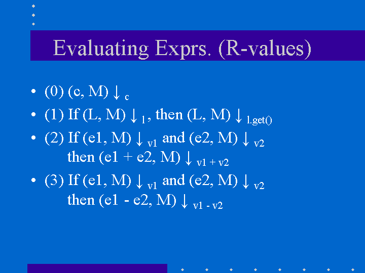
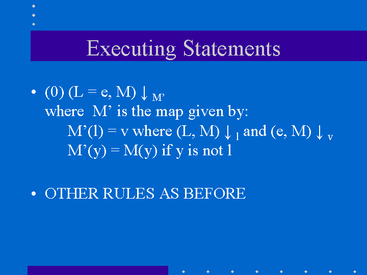
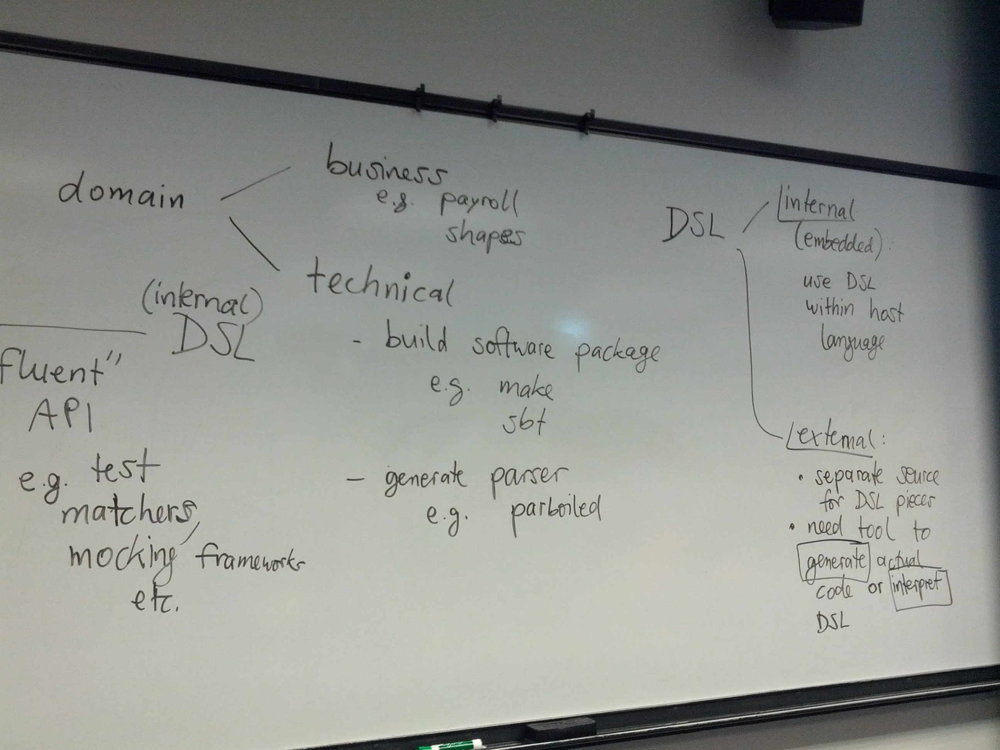
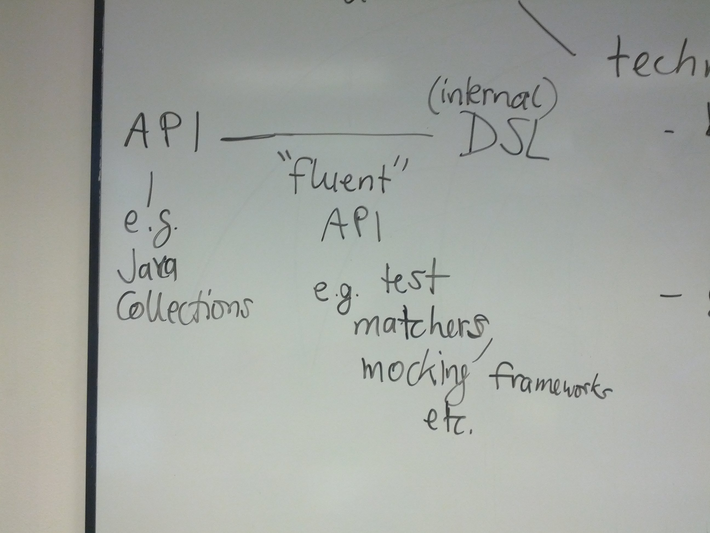

Program Representation and Interpretation
-----------------------------------------

In this chapter, we discuss how we can represent and ultimately execute or interpret programs in a particular language.
To this end, we need to talk about the toolchain required to do so, as well as techniques for defining the meaning (semantics) of programs in our language.


Programming language toolchains
~~~~~~~~~~~~~~~~~~~~~~~~~~~~~~~

We will start with an overview of the phases of programming language `compilation <http://en.wikipedia.org/wiki/Compiler>`_/`interpretation <http://en.wikipedia.org/wiki/Interpreter_(computing)>`_ toolchain:

- source code (string stored in file)
- *lexical analysis*
- sequence of tokens
- *syntax analysis (parsing)*
- abstract syntax tree <- interface between front end and back end
- *static checks*
- *optimization*
- transformed abstract syntax tree
- *code generation*
- machine code or byte code
- *execution*
- alternative: *direct interpretation of abstract syntax trees*


Reference: `Mogensen <http://www.diku.dk/hjemmesider/ansatte/torbenm/Basics>`_


Compiler front-end concepts and techniques
~~~~~~~~~~~~~~~~~~~~~~~~~~~~~~~~~~~~~~~~~~

In this section, we will discuss the key front-end stages, lexical analysis and syntax analysis, and related concepts and techniques.


Lexical analysis
````````````````

- regular expressions, NFA, DFA (Mogensen ch. 2)
- `regular expressions <http://algs4.cs.princeton.edu/lectures/54RegularExpressions.pdf>`_
- `regular expressions in Java <http://java.ociweb.com/javasig/knowledgebase/2005-05/JavaRegex.pdf>`_

Syntax analysis
```````````````
  
- context-free grammars, EBNF, parsing (Mogensen ch. 3)
- `parser generator <https://en.wikipedia.org/wiki/Compiler-compiler>`_
- `scala-bison <https://github.com/djspiewak/scala-bison>`_


  
Alternative front-end approaches
````````````````````````````````
  
- `parser combinators <https://en.wikipedia.org/wiki/Parser_combinator>`_
- Scala parser combinators

  - `Odersky et al. ch. 33 <http://proquestcombo.safaribooksonline.com.flagship.luc.edu/book/programming/scala/9780981531687/combinator-parsing/combinator_parsing_html>`_
  -  `API <http://www.scala-lang.org/api/current/scala-parser-combinators) [tutorial](https://wiki.scala-lang.org/display/SW/Parser+Combinators--Getting+Started>`_
  - `simple expression combinator parser example <https://github.com/lucproglangcourse/expressions-scala/blob/master/src/main/scala/CombinatorParser.scala>`_

- `parsing expression grammars <http://en.wikipedia.org/wiki/Parsing_expression_grammar>`_
- `From EBNF to PEG <http://ceur-ws.org/Vol-928/0324.pdf>`_
- Parboiled 2 PEG library

  - `parboiled2 documentation <https://github.com/sirthias/parboiled2>`_
  - `parboiled2 JSON parser example <https://github.com/sirthias/parboiled2/blob/master/examples/src/main/scala/org/parboiled2/examples/JsonParser.scala>`_

    

Programming language semantics
~~~~~~~~~~~~~~~~~~~~~~~~~~~~~~

Semantics, a formalization of the *meaning* of programs in a particular language, includes *static* and *dynamic* semantics.

- `static semantics <http://en.wikipedia.org/wiki/Programming_language#Semantics>`_ (compile-time)

  - flow analysis
  - typing

- `dynamic semantics <http://en.wikipedia.org/wiki/Semantics_of_programming_languages>`_ (run-time)

  - denotational
  - operational, e.g. our interpreters
  - axiomatic

The Interpreter pattern is related to the discussion of dynamic semantics.

- http://c2.com/cgi/wiki?InterpreterPattern
- http://en.wikipedia.org/wiki/Interpreter_pattern


Case study: a simple imperative language
~~~~~~~~~~~~~~~~~~~~~~~~~~~~~~~~~~~~~~~~

In this section, we discuss the design of an interpreter and programming environment for a simple imperative language. 

- `Java implementation <https://github.com/LoyolaChicagoCode/misc-java/blob/master/src/main/java/imperative/SimpleImperative.java>`_
- `Scala implementation <https://github.com/LoyolaChicagoCode/misc-scala/blob/master/src/main/scala/imperative/>`_

The accompanying lecture is available as a set of screencasts: 

- `foundations <https://youtu.be/-bDcsvlY5oA>`_
- `implementation <https://youtu.be/mj-tq_kdeF>`_

  
Objectives
``````````

We are leading toward building an interpreter for a language resembling JavaScript with object-like features. We are doing this with two aims in mind:

- To understand an object-oriented programming language from the "inside".
- To understand better the object-oriented and functional design patterns that we have learned by using them in the context of a small but somewhat sophisticated program.

Syntax
``````

Our language has the following features:

Integer expressions given by the BNF grammar::

    e ::= variable
      |   const
      |   e1 + e2
      |   e1 - e2


Statements given by the BNF grammar::

    S ::= x = e
      |   S1 ; S2
      |   while (e) S


In the context of the lectures so far, we have made the following changes. We have added variables to expressions, thus we can handle cases like `x + 3`, whereas earlier we could only write expressions such as `4 + 3`. We have also introduced the assignment statement as a way to change the contents of a variable. In addition, we allow statements to be put in sequence. We also permit simple while expressions, where the guard is an expression and the loop body is executed while the gurad expression evaluates to a non-zero integer value.

Structured operational semantics (SOS)
``````````````````````````````````````

We first formalize the intuitive execution semantics of the toy language. The point of doing this is to present the basic ideas in the interpreter without getting tied up in the programming details of the interpreter. In any case, these details are presented later in this lecture. Since our toy language has variables, we need to keep track of the state of variables. We view variables as objects with two capabilities:

- `v.get()` returns the current value of the variable
- `v.set(int i)` changes the current value of the variable to that of `i`

We think of the state of the program (memory store), which we write `M`, as a map that associates identifiers with variable objects.

The rules for evaluating expressions are quite simple.

- Evaluating constant `c`. Every constant evaluates to itself.
- Evaluating a variable whose name is `x`: Retrieve the variable object (say `v`) associated with `x` from the memory store `M`, by using `M(x)`. The required result is computed by invoking `v.get()`.
- Evaluating `e1 + e2`: Evaluate `e1` first, say to yield value `r1`. Evaluate `e2` next, say to yield value `r2`. The required result is the numeric value `r1 + r2`.
- Evaluating `e1 - e2`: Evaluate `e1` first, say to yield value `r1`. Evaluate `e2` next, say to yield value `r2`. The required result is the numeric value `r1 - r2`.

The evaluation rules are written out precisely in the following picture.

.. image:: images/evaluation.png


The rules for executing statements is as follows. In contrast to expression evaluation, statement execution does not yield a result. The primary consequence of executing a statement is the side effect on the store, ie. changes in the values of variables.

- Executing an assignment statement: Consider the assignment statement `x = e`. Here `e` is an expression. The steps are as follows:  First, evaluate the expression `e` to yield a result, say `r`.  Next, retrieve the variable object (say `v`) associated with `x` from the memory store `M`, by using `M(x)`.  Perform `v.set(r)` to change the value of the variable object.

- Executing a sequence of statements `S1; S2`: Execute `S1` first. When that terminates, execute `S2`.

- Executing `while (e) do S`: Evaluate the condition `e` to yield a result `r`. If `r` is zero, the execution terminates. Otherwise, execute `S` and repeat the process.

The execution rules are given in the following pictures:

.. image:: images/execution1.png


.. image:: images/execution2.png

Note that the connection between the various statements is that they share a single store, ie. in the sequence of statements `x = 2; y = x + 1`, the second reference to `x` reflects the effect of the first assignment because of the (shared) store between the two assignment statements.


The interpreter program
```````````````````````

We now go ahead and write the interpreter program.
The entire code is available as part of the `misc-scala <https://github.com/lucproglangcourse/misc-scala/tree/master/src/main/scala/imperative>`_ example.
A similar example but based on F-algebras and with better runtime error handling is also available: `simpleimperative-algebraic-scala <https://github.com/LoyolaChicagoCode/simpleimperative-algebraic-scala>`_.


Case study: a simple imperative language with records
~~~~~~~~~~~~~~~~~~~~~~~~~~~~~~~~~~~~~~~~~~~~~~~~~~~~~

In this section, we discuss the design of an interpreter and programming environment for a simple imperative language with records (like classes with public fields and without methods).

Objectives
``````````

We are leading toward building an interpreter for a language resembling JavaScript with object-like features. We are doing this with two aims in mind:

- To understand an object-oriented programming language from the "inside".
- To understand better the object-oriented and functional design patterns that we have learned by using them in the context of a small but somewhat sophisticated program.

We now consider the changes that arise from the addition of records. Thus, we permit:

- declaration of record types
- creation of new records of a given record type
- selection of record fields
- use of records on the left and right hand side of expressions

Syntax
``````

Our language has the following features:


The syntactic feautures of our language are captured by the following grammar. For motivation, the sort of program that we are interested is exemplified by::

    StudentCourseRecord = record 
        int firstExamScore;
        int secondExamScore;
        int totalScore;
    end;

    StudentSemRecord = record 
        StudentCourseRecord course1;
        StudentCourseRecord course2;
    end;

    StudentSemRecord r = new StudentSemRecord();
    r.course1 = new StudentCourseRecord();
    r.course1.firstExamScore = 25;
    r.course1.secondExamScore = 35;
    r.course1.totalScore = r.course1.firstExamScore + r.course1.secondExamScore;

    r.course2 = r.course1;

    
In the C language, such things are known as structs. In familiar object-oriented terminology, we can think about them in this way:

- record types are classes whose only members are public member variables
- records are objects
- fields are public member variables

The record type definitions in the previous example would look as follows in Java, and the rest of program would look the same::

    class StudentCourseRecord {
        public int firstExamScore;
        public int secondExamScore;
        public int totalScore;
    }

    class StudentSemRecord {
        public StudentCourseRecord course1;
        public StudentCourseRecord course2;
    }

    
Formally, we proceed via the following BNF grammars. To simplify life for us, we will ignore type information. In this BNF grammar, we are a little bit more careful to separate L(eft) values and R(ight) values. L-values are those that can appear on the left hand side of an assignment statement, and R-values are those that appear on the right hand side of an assignment.

Record definitions are given by the BNF grammar::

    Defn ::= record
                 FieldList
             end


    FieldList ::= fieldName, FieldList
              |	fieldName

	      

L-values (fields selected from records, as well as variables) are given by the BNF grammar::

    Lval ::= e.fieldName
         | variable


Expressions (R-values) are given by the BNF grammar::

    e	::=	new C
     	|	Lval
     	|	const
     	|	e1 + e2
     	|	e1 - e2


Statements are given by the BNF grammar::

    S	::=	Lval = e
     	|	S1; S2
     	|	while (e) do S

	
We first formalize the intutive execution semantics of the toy language. As before, the point of doing this is to present the basic ideas in the interpreter without getting tied up in the programming details of the interpreter. In any case, these details are presented later in this lecture. In particular, in this initial first cut, we will begin by ignoring declarations. Also, in this new presentation

Recall that we viewed variables as objects with two capabilities:

- get() returns the current value of the variable
- set(int x) changes the current value of the variable to that of x

Records are thought of in a similar light.

.. image:: images/records1.png 

As before, we think of the state of the program, which we write S, as a map that associates identifiers with variable objects. Furthermore, as before, we distinguish evaluation and execution. In evaluation, there are two subcases, evaluating to an L-value and evaluating to an R-value.

.. image:: images/records2.png 

There are two ways of having L-values. One is via variables and the second is via field selection.

- The L-value associated with a variable name is the associated variable object.
- The L-value associated with a selection e.f is obtained by first evaluating the expression e to an R-value, say r. Next, lookup on the record r with field name f is used to get the desired L-value.

These evaluation rules are written out precisely in the following picture.

.. image:: images/records3.png 

Our earlier rules for evaluating R-values are presented again below..

- Evaluating an L-value. In our setup, every L-value (say l) is a variable object that is obtained from the store M. Execute l.get() to compute the return value. This rule subsumes the earlier case for variables.
- Evaluating e1 + e2: Evaluate e1 first, say to yield value v1. Evaluate e2 next, say to yield value v2. The required result is v1 + v2.
- Evaluating e1 - e2: Evaluate e1 first, say to yield value v1. Evaluate e2 next, say to yield value v2. The required result is v1 - v2.
- Evaluating constant c. Every constant evaluates to itself.



The rules for executing statements are as follows. They are similar to the ones seen before. The primary consequence of executing a statement still is the side effect on the store, ie. changes in the values of variables.

- Executing an assignment statement L = e. Here L is an L-valued expression and e is an R-valued expression. The steps are as follows. First, evaluate the expression L to yield an L-value, say l. Next, evaluate the expression e to yield an R-value, say v. Next, use l.set(v) to change the value of the variable object.
- Executing a sequence of statements "S1; S2" and a "while" loop are as before.

The execution rules are given in the following pictures:




Implementation
``````````````

The entire code for the implementation of the simple imperative language with records is available `here <https://github.com/lucproglangcourse/misc-scala/tree/master/src/main/scala/records>`_.


Type systems
~~~~~~~~~~~~

Type systems are an important aspect of programming languages.
We identify the following dimensions:

- static versus dynamic
- strong versus weak
- implicit versus explicit

.. image:: images/DesignSpaceTypeSystems.jpg 

Additional information is available here:	   

- `design space and tradeoffs <http://en.wikipedia.org/wiki/Type_system>`_
- `representative examples <http://en.wikipedia.org/wiki/Comparison_of_type_systems>`_
- `presentation slides 10-29 <http://klaeufer.github.io/luc-amc.html#(10)>`_
- `performance implications/shootout <http://benchmarksgame.alioth.debian.org/u64q/which-programs-are-fastest.php>`_


Domain-specific languages
~~~~~~~~~~~~~~~~~~~~~~~~~

Domain-specific languages are special-purpose languages for solving problems in particular domains.
We identify the following dimensions:

- internal/embedded language versus external language
- business domain versus technical domain



In addition, there is a continuum between APIs and internal DSLs.



Additional information is available here:	   

- http://c2.com/cgi/wiki?DomainSpecificLanguage
- http://martinfowler.com/bliki/FluentInterface.html
- http://martinfowler.com/bliki/DomainSpecificLanguage.html
- http://martinfowler.com/books/dsl.html
- http://en.wikipedia.org/wiki/Domain-specific_language
- `SE Radio episode 182 <http://feedproxy.google.com/~r/se-radio/~3/2VCOnKZ97MU/>`_


